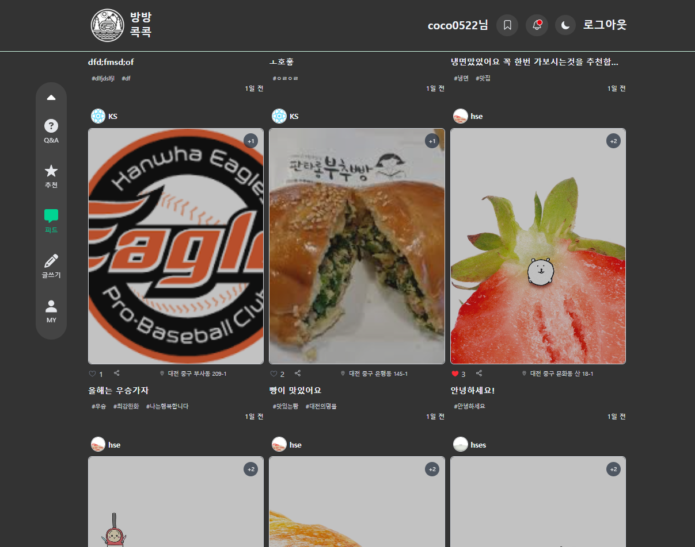
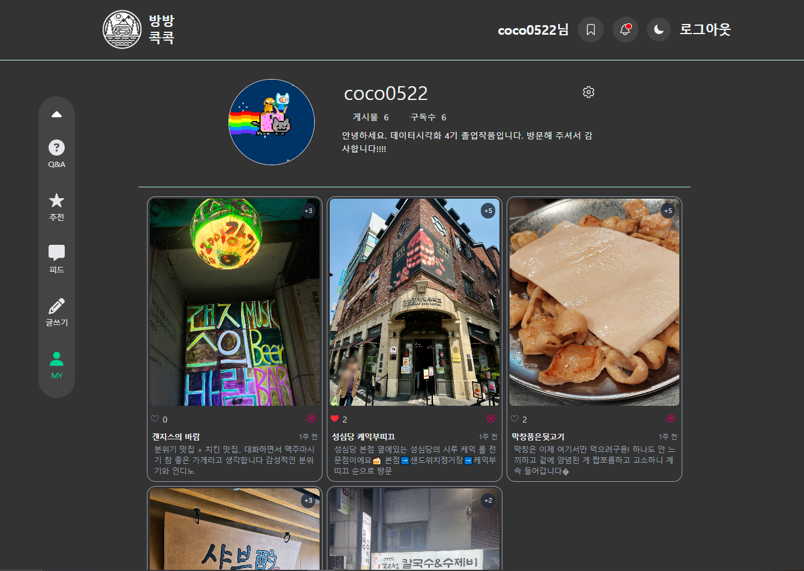
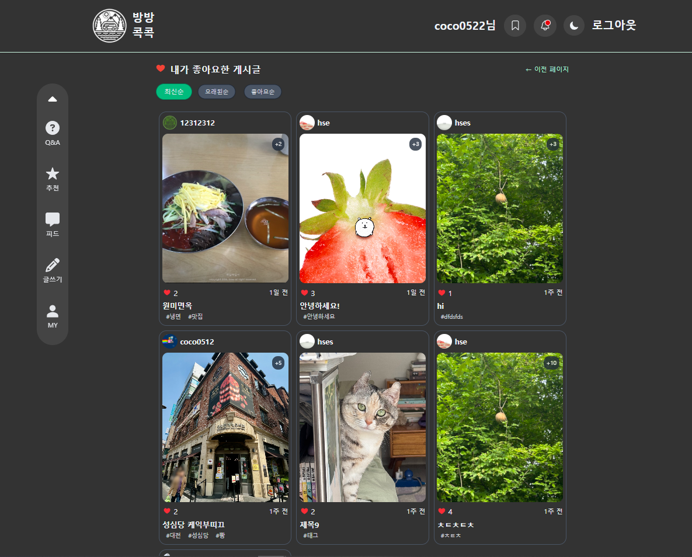

# 🧭 방방콕콕 (BangBangKokKok)

> 여행 사진 중심의 SNS 플랫폼  
> **React, Next.js, TypeScript, Firebase** 기반의 실전형 프로젝트

---

## 🔧 사용 기술 스택

- **Frontend**: React, Next.js (App Router), TypeScript, Tailwind CSS
- **State Management**: React Context, React Query (데이터 캐싱 최적화)
- **Backend (BaaS)**: Firebase Authentication, Firestore, Storage
- **API**: 카카오 맵 API, 한국관광공사 TourAPI (추천 장소)
- **UI/UX**: 반응형 레이아웃, 다크모드, 모달 뷰, 무한스크롤

---

## 📌 주요 기능

- 사용자 회원가입 / 로그인 (Firebase Auth)
- 사진 업로드 및 게시물 피드 생성
- **좋아요 / 북마크 / 팔로우 / 실시간 구독자 수 반영**
- 마이페이지 / 타인 프로필 분기 처리
- 북마크 정렬(최신순, 좋아요순), 선택 삭제
- 장소 태그, 지도 연동, 한국관광공사 API 활용
- 무한스크롤 & React Query로 데이터 최적화

---

## ✨ 기술적 구현 포인트

- **Next.js App Router 구조 기반 SSR/CSR 분기 고려**
- Firebase와 Firestore를 활용한 **데이터 모델링 및 실시간 반영**
- React Query를 통한 **캐싱, 페이징, 로딩 최적화**
- **반응형 레이아웃과 다크모드** 등 UI/UX 강화

---

## 🎯 프로젝트 목적

> 단순 클론이 아닌, SNS 구조를 직접 설계하고  
> 실제 배포 가능한 수준의 웹앱을 구현하는 것을 목표로 했습니다.  
> 실무에 가까운 구조로 React + Firebase 기반의 SNS 아키텍처를 설계하며,  
> **프론트엔드 전반에 대한 이해도와 실전 적용 능력을 키웠습니다.**

---

## ▶️ 배포 링크 (Vercel)

👉 [https://last-project-main.vercel.app/]

---

## 📷 주요 화면 미리보기

> 피드 페이지
> 

> 프로필 페이지
> 

> 북마크 페이지
> 

---

## 🧑‍💻 개발자

- **강찬희**
  - GitHub: [uidata101](https://github.com/uidata11/lastProjectMeme) 또는 (https://github.com/kunghwan/lastProject) 의 kch branche
  - Email: chan7pp@google.com

---
